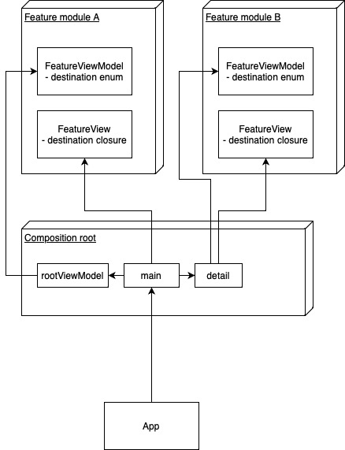

# Composition - A Composition root case study with additions

The goal of this case study is to model an application with many dependencies and modules, bringing them all together in the pattern known as Composition root.

This sample comprises of the main App project, bundled together with 3 submodules - Models, a shared package declaring the data types; FeatureA, one sample of a module and FeatureB, another module similar to FeatureA.

According to the dependency inversion principle, Features A and B delegate their dependencies upward to the implementor. In order to simplify this case study, the only dependencies exposed are the destination views from either feature.

The navigation is modelled in a tree-based fashion. Each feature has a ViewModel which holds the destination property, an enum type, thereby allowing only one destination being active at one time. This allows for a more natural modelling than having a boolean for each destination (which allows for non-sensical combinations).

